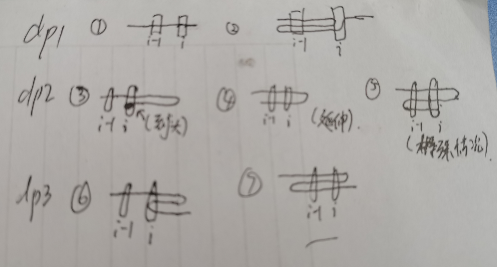

# Codeforces Round #666 (Div. 1)

高考后好久一直懒得打最近才想起来打

然后打一场665的Div2直接蓝上黄了于是这次只能打Div1

第一次打Div1，Div2前两道题没看

做题时候A被卡n=1,B被卡nim，C肝出来了直接放弃DE，第二天把DE肝一肝

然后刚上橙名就掉紫了，下次水一场div2打上去

啊这...667只有div3，668是两场都有，还是好好打668的div1吧[笑哭]

以下为题解

## A(Div2.C)

题目大意：给出一个数列（1e9，可正可负可零），你需要进行恰好三次操作，每次选择一段区间，把这段区间每一个数加上一个这段期间长度的倍数（1e18，可正可负可零），最后使得这个数列变成全0，求操作。

解答：注意到长度为n和长度为n-1差1，所以我们对ai依次进行`-=n*ai`然后`+=(n-1)*ai`

第一个操作可以全员进行，第二个操作可以选取一个n-1长度的进行然后在进行第三次操作对单独一个进行即可（任何数都是1的倍数）

`n=1`要特判，我就是这么在第二个点wa了5次。

## B(Div2.D)

题目大意：俩人玩取石子，n个石子，每次每人取一堆中的一个，并且要求他取的这一堆不能是上一次那个人取过的，求谁赢

解答：（来自同学）如果有一堆石头比其它堆石头的和都大，那么先手可以不停取最大这堆，显然先手胜

否则：由于他俩都很聪明，xjb想想就能想出来不会出现某人取到只剩一堆可以取并且另一个人只能望着这一堆不能取的棋子而失败的情况，也就是最后棋子一定是取完的，然后由于每次每人只取一个，直接判奇偶

## C(Div2.E)

题目大意：有 n 个点线性排列，每个点有 ai 个一滴血的普通怪和一个两滴血的boss怪，你一开始在1号点，每次你可以用：

- 手枪耗费时间r1，选1个怪打他一滴血（可以是boss）
- 激光枪耗费时间r2，将当前点所有怪各打一滴血
- AWP耗费时间r3，选1个怪将他干掉
- 花费时间d移动到相邻的点（i-1或i+1）

满足r1<=r2<=r3

要求在某个点所有普通怪没死之前不能用手枪或AWP打boss怪，如果打boss但是boss没死你就不能接着打会被迫走到相邻点（可以选），求打死所有怪最短时间。

解答：对于每个点可以选三种情况：

- 手枪挨个干死所有普通怪，然后AWP干死boss

- 手枪挨个干死所有普通怪，然后手枪两枪干死boss，但是需要被迫传送，所以这点要走两次
- 激光枪直接干死所有普通怪+给boss一滴血然后被迫传送，然后回来手枪一枪干死boss，这点也需要走两次

我们对每个点处理出c1和c2分别表示这个点走一次和走两次花费

那么：`c1[i]=a[i]*r1+r3`并且`c2[i]=min((a[i]+2)*r1,r1+r2)`

然后我们发现由于一个点可以重复走，并且最后不一定必须在n号点，所以一条路最多走三次，这样就可以理解为在序列上选一条可以拐弯的路径最后长度最小的dp

`dp1[i]~dp3[i]`分别代表当前第i个点，目前延伸1 2 3条路径的时间最小

那么写出转移，`dp1[i]`可以由`dp1[i-1]+d+c1[i]`转移（图1）（一直是只走1次）

还可以是`dp3[i-1]+3d+c2[i]`，（图2）

`dp2`由dp1（图3）或dp2（图4）或dp3（图5）转移

`dp3`由dp1（图6）或dp3（图7）转移

收集答案：

`dp1[n]`可以直接用

`dp2[n]`不能直接用，看着像n号点走了两次但是他只走了一次，因此要用`dp2[n]-c2[n]+c1[n]`

或者是我强制多返回一次，也就是`dp2[n]+2*d`

`dp3[n]`也不能直接用，他可能是由dp1转移过来的，看着走了三次其实这是折返的起点但是没算进去，所以要用`dp3[n-1]+3*d+c2[n]`保证是折返终点

## D(解法待研究)

题目大意：有一个长宽都为L的正方形，一共有n个糖，每一个格子里可能会放最多一个糖，一共有k种颜色，每个糖都有一种颜色，求正方形的子矩形的个数，使得这个矩形里面所有颜色的糖都出现过，对1e9+7取模

L是1e9，k和n是2e3

解答：不会

## E(解法待研究)

题目大意：

一棵n个点的树，n是偶数<=1e5，给定k<=n方，请把树上的所有节点做配对（七夕节虐狗），使得每一对点之间的距离的和为k，如果没有方案直接输出NO，否则输出YES和方案（任意一个就行）

解答：不会
